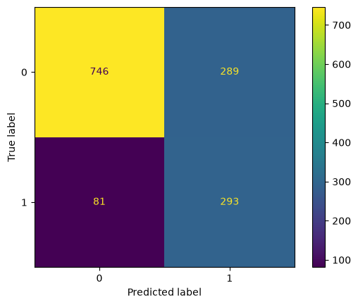
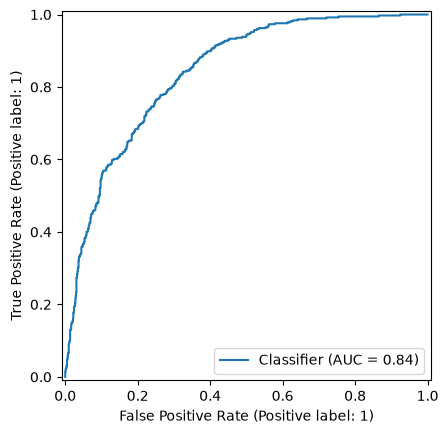
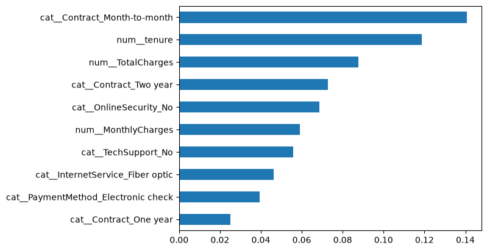

# Customer Churn Prediction System

A machine learning project that predicts whether a telecom customer is likely to **churn** (cancel their service). The project covers the full workflow — exploratory data analysis, data cleaning, feature engineering, preprocessing, model training, and evaluation — and compares two classification models to identify customers at risk and the key factors driving churn.

## Dataset

[Telco Customer Churn](https://www.kaggle.com/datasets/blastchar/telco-customer-churn) (Kaggle), already included in this repo at [data/Telco-Customer-Churn-dataset.csv](data/Telco-Customer-Churn-dataset.csv).

- **7,043 customers**, 21 columns
- **Target:** `Churn` (`Yes`/`No`) — imbalanced: 5,174 stayed (73.5%) vs. 1,869 churned (26.5%)
- **Features:**
  - Demographics — `gender`, `SeniorCitizen`, `Partner`, `Dependents`
  - Account info — `tenure`, `Contract`, `PaperlessBilling`, `PaymentMethod`, `MonthlyCharges`, `TotalCharges`
  - Subscribed services — `PhoneService`, `MultipleLines`, `InternetService`, `OnlineSecurity`, `OnlineBackup`, `DeviceProtection`, `TechSupport`, `StreamingTV`, `StreamingMovies`

## Approach

All work is done in [notebook.ipynb](notebook.ipynb):

1. **EDA** — checked missing values and class balance, and visualized how churn relates to contract type, tenure, monthly charges, internet service, and gender (see [images/visualization_of_features](images/visualization_of_features)).
2. **Data cleaning** — converted `TotalCharges` to numeric (11 blank values found and filled with the median), dropped the `customerID` identifier column, and encoded the target as `0`/`1`.
3. **Feature engineering** — binned `tenure`, `MonthlyCharges`, and `TotalCharges` into interpretable groups (e.g. `0-1y`, `1-2y`, …) for further analysis.
4. **Preprocessing** — a `ColumnTransformer` that applies `StandardScaler` to numeric features and `OneHotEncoder` to categorical features, wrapped in a scikit-learn `Pipeline` together with each model.
5. **Train/test split** — 80/20, stratified by `Churn`, with a fixed `random_state` for reproducibility.
6. **Modeling** — two classifiers, both trained with `class_weight='balanced'` to counteract the class imbalance:
   - **Logistic Regression** — a simple, interpretable baseline.
   - **Random Forest** (300 trees, max depth 8) — a stronger, non-linear model.
7. **Evaluation** — classification report (precision/recall/F1), ROC-AUC, confusion matrix, and ROC curve for each model.
8. **Feature importance** — extracted from the Random Forest to identify the strongest churn drivers.
9. **Model comparison** — Accuracy, Precision, Recall, F1, and ROC-AUC compared side by side.

## Results

| Model | Accuracy | Precision | Recall | F1 | ROC-AUC |
|---|---|---|---|---|---|
| Logistic Regression | 0.737 | 0.503 | 0.783 | 0.613 | 0.841 |
| Random Forest | 0.748 | 0.517 | 0.786 | 0.624 | 0.841 |

*(Precision/recall/F1 reported for the churn = "Yes" class; full per-class report is in the notebook.)*

- Both models reach a **ROC-AUC of ~0.84**, meaning they distinguish churners from non-churners quite well.
- **Random Forest slightly outperforms** Logistic Regression across accuracy, precision, recall, and F1, though the gap is small — the dataset's signal is largely linear.
- Thanks to `class_weight='balanced'`, both models favor **recall over precision** for the churn class (~78% of churners are caught), which is usually the right trade-off for a retention use case: missing an at-risk customer is costlier than a false alarm.
- The strongest churn drivers, per Random Forest feature importance, are: **month-to-month contracts**, **low tenure**, **total/monthly charges**, having a **two-year contract** (protective), **no online security**, **no tech support**, **fiber optic internet**, and **electronic check** payment.

<p align="center">
  
</p>

<p align="center">
  
</p>

<p align="center">
  
</p>

## How to run

```bash
python3 -m venv venv
source venv/bin/activate      # on Windows: venv\Scripts\activate
pip install -r requirements.txt
jupyter notebook notebook.ipynb
```

The dataset is already included in [data](data), so no manual download is needed — run the notebook cells top to bottom to reproduce the EDA, training, and evaluation. Core libraries used: `pandas`, `numpy`, `scikit-learn`, `matplotlib`, `seaborn`, run inside `jupyter`.

## Possible improvements

- **Use the engineered bin features** (`tenure_group`, `MonthlyCharges_group`, `TotalCharges_group`) in the model pipeline — they're currently created during feature engineering but not yet fed into the classifiers.
- **Hyperparameter tuning** with `GridSearchCV`/`RandomizedSearchCV` instead of fixed parameters.
- **Cross-validation** (e.g. stratified k-fold) instead of a single train/test split, for more reliable performance estimates.
- **Try gradient boosting models** such as XGBoost or LightGBM, which often outperform Random Forest on tabular data like this.
- **Better handle class imbalance** — compare `class_weight='balanced'` against resampling techniques (SMOTE/undersampling) or decision-threshold tuning.
- **Model interpretability** with SHAP values for per-customer explanations, beyond the built-in feature importance.
- **Persist and serve the model** — save the trained pipeline (e.g. via `joblib`) and expose it through a small API (FastAPI/Flask) for real-time churn scoring.
- **Experiment tracking** — log runs and metrics with a tool like MLflow to compare experiments over time.
